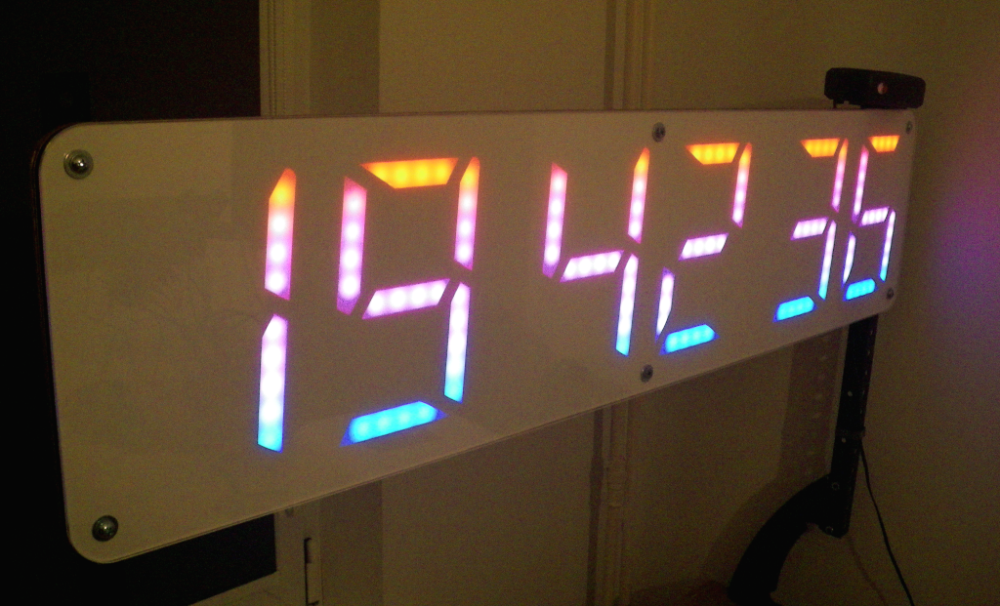

# STM32F103 RTIC playground 

Some example apps aiming at evaluating and learning [RTIC](https://rtic.rs/1.0/book/en/)
and general use of Rust in embedded (`no_std`) setting.

## [oled_timer_test](src/bin/oled_timer_test.rs)

Not much to say about this. Just a simple app controlling an I2C OLED display.

## [gps_alarm_clock.rs](src/bin/gps_alarm_clock.rs)

More of a real-world application - GPS-synchronized alarm clock:

 - big WS2812 LED strip display
 - IR remote controlled
 - DST flag and alarms kept in simulated EEPROM
 - Nokia RTTTL alarms (need to be converted to a list of frequencies)
 - talking clock function (speech synthesized using LPC via PWM output,
   for more details see [here](https://github.com/mryndzionek/dsp_experiments/tree/main/lpc_encoder)
   and [here](https://github.com/mryndzionek/dsp_experiments/tree/main/lpc_decoder))
 - different display effects



Encountered problems:

 - the app in `release` is about 120kB of flash
 - the ISRs a slower than in C, so I couldn't for example communicate with GPS at 115200
 - WS2812 communication is fast enough only in `release` and 's'/'z' optimization destroys the timing

### Reconfiguring GPS modules

U-blox GPS modules can be recofigured using `ubxtool` from [GPSd](https://gpsd.gitlab.io/gpsd/).
Remember to use latest (at least gpsd-3.23.2):

```
ubxtool -S 38400 -f /dev/ttyUSB0 -v1
ubxtool -s 38400 -p CFG-TP5,0,,,1000000,1000000,250000,25000,,0x37 -f /dev/ttyUSB0 -v1
ubxtool -s 38400 -p SAVE -f /dev/ttyUSB0 -v1
```

For Quectel GPS modules:

```
$PQ1PPS,W,4,100*1D
$PQBAUD,W,38400*7B
```

## Compiling bindings

```
bindgen --ctypes-prefix=cty --use-core c/bindings.h > src/c_bindings.rs
```


